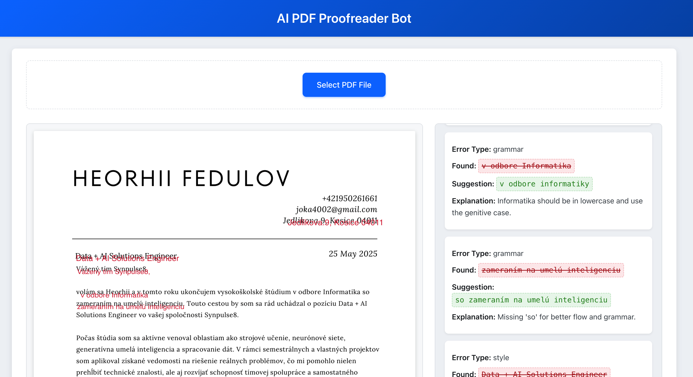

# AI PDF Proofreader Bot

A web application that allows users to upload PDF files for text analysis using AI (powered by Google Gemini API). The application displays detected errors and offers the functionality to download a "corrected" version of the PDF (with text-based corrections applied to the extracted text).

## Screenshots 





## Tech Stack

*   **Backend:**
    *   Python 3.11+
    *   FastAPI (for creating the REST API)
    *   Uvicorn (ASGI server)
    *   Google Generative AI SDK (for interacting with the Gemini API)
    *   PyMuPDF (fitz) (for extracting text from PDF files)
    *   ReportLab (for generating new PDF files with corrections)
    *   python-dotenv (for managing environment variables)
*   **Frontend:**
    *   React (JavaScript library for the UI)
    *   react-pdf (for displaying PDF files in the browser)
    *   Fetch API (for making HTTP requests to the backend)
    *   CSS (for styling)
*   **Deployment & Environment:**
    *   Docker
    *   Docker Compose

## Features

*   User-friendly PDF file upload.
*   Text extraction from PDF files on the backend.
*   AI-powered text analysis using Google Gemini API to identify grammatical, spelling, and stylistic errors.
*   In-browser PDF document display.
*   Side-panel listing of detected errors corresponding to the current PDF page.
*   **Experimental highlighting** of erroneous text fragments directly on the displayed PDF.
*   Option to download a new PDF file where suggested corrections have been applied to the extracted text (note: original PDF formatting is not preserved in the corrected PDF).

## Prerequisites

*   **Docker and Docker Compose:** Must be installed on your system.
    *   [Install Docker](https://docs.docker.com/get-docker/)
    *   Docker Compose is typically included with Docker Desktop.
*   **Google API Key:** An active API key for Google Generative AI (Gemini API) is required.
    *   You can obtain a key from [Google AI Studio](https://aistudio.google.com/app/apikey) or via the Google Cloud Console.
    *   Ensure that your project and API key have access to the necessary models (e.g., `models/gemini-1.5-flash-latest`).
*   **Node.js and npm/yarn (Optional):** Required for local frontend development if not using Docker for the frontend.

## Setup and Running the Application

1.  **Clone the Repository:**
    ```bash
    git clone https://github.com/bardasto/HackatonTelekom.git 
    cd HackatonTelekom
    ```
    (Replace the URL with your actual repository URL if it's different)

2.  **Configure Backend API Key:**
    *   Navigate to the `backend/` directory.
    *   Copy the `.env.example` file to a new file named `.env`:
        ```bash
        cp backend/.env.example backend/.env
        ```
    *   Open `backend/.env` in a text editor and insert your `GOOGLE_API_KEY`:
        ```env
        GOOGLE_API_KEY="YOUR_GOOGLE_API_KEY_HERE"
        # GEMINI_MODEL_NAME="models/gemini-1.5-flash-latest" # You can override the model here if needed
        ```
    

3.  **Configure Frontend API URL (for local development without Docker):**
    *   The file `frontend/.env.development.local` should already contain:
        ```env
        REACT_APP_API_BASE_URL=http://localhost:8000/api/v1
        ```
    *   This is used when running the frontend locally with `npm start`, allowing it to communicate with the backend服务 running on port 8000. When using Docker Compose for the entire stack, this variable is typically not needed for the frontend build, as Nginx might proxy requests or the frontend would connect to the backend via its internal service name (if configured).

4.  **Run with Docker Compose (Recommended):**
    *   Make sure you are in the root directory of the project (`HackatonTelekom/`).
    *   Build and start the services:
        ```bash
        docker-compose up --build
        ```
        The `--build` flag ensures images are freshly built. For subsequent runs, `docker-compose up` might be sufficient if no Docker-related files have changed.

5.  **Access the Application:**
    *   **Frontend:** Open your web browser and navigate to `http://localhost:3000`
    *   **Backend API Docs (Swagger UI):** `http://localhost:8000/docs`
    *   **Backend API Docs (ReDoc):** `http://localhost:8000/redoc`

## Stopping the Application

*   Press `Ctrl+C` in the terminal where `docker-compose up` is running.
*   To stop and remove the containers, networks, and volumes:
    ```bash
    docker-compose down -v
    ```
    (Use `docker-compose down` if you want to keep volumes.)

## Development

### Backend (Local, without Docker)
```bash
cd backend
python -m venv venv

pip install -r requirements.txt

uvicorn app.main:app --reload --port 8000